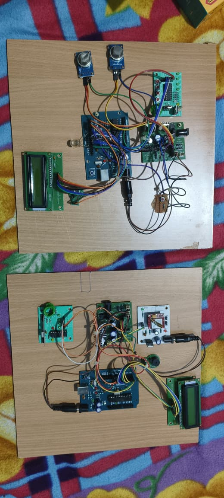
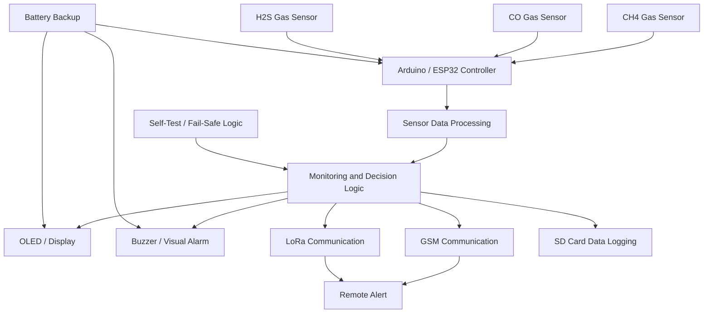

# Real-Time Mine Safety Monitoring and Gas Detection System

## Major Diploma Project | Electronics & Communication Engineering

A real-time mine safety monitoring and gas detection system developed as a **major diploma project** to monitor hazardous gases and provide local and remote warning indications.

The project combines **gas sensing, embedded processing, display, audible/visual alarms, wireless communication, data logging, battery backup, self-test functionality, and fail-safe alarm concepts** into a single safety-oriented prototype.

---

# 1. Project Overview

Mining environments can contain hazardous gases that may create unsafe working conditions.

The objective of this project was to develop a prototype capable of continuously monitoring hazardous gases and providing immediate warning indications when unsafe conditions are detected.

The system monitors:

- Methane (CH4)
- Carbon Monoxide (CO)
- Hydrogen Sulfide (H2S)

The monitored information is processed using an embedded controller and presented through a local display. The system also supports alarm indication, GSM/LoRa communication, SD-card data logging, battery backup, self-test functionality, and fail-safe alarm concepts.

This project provided practical experience in **embedded systems, hardware integration, sensor interfacing, communication modules, data logging, hardware testing, troubleshooting, and project leadership**.

---

# 2. Project Objectives

The main objectives of this project were:

- To continuously monitor hazardous gases in a mining-oriented environment.
- To detect CH4, CO, and H2S using gas sensors.
- To process sensor information using Arduino/ESP32-based embedded hardware.
- To provide local monitoring through a display.
- To activate audible and visual alarms during hazardous conditions.
- To provide remote alert capability using GSM and LoRa.
- To record monitoring information using an SD-card interface.
- To incorporate battery backup for improved system continuity.
- To include self-test and fail-safe concepts.
- To develop and test a complete working hardware prototype.

---

# 3. Project Hardware Prototype

> ## 📸 IMPORTANT — ACTUAL PROJECT HARDWARE
>
> The photograph below shows the **actual hardware prototype developed for this major diploma project**.
>
> It is recommended to keep this image prominently displayed in the GitHub README because it provides visual evidence of the physical hardware integration, wiring, controller, sensors, display, and supporting modules used during development.



### Hardware Prototype Highlights

The prototype demonstrates the physical integration of:

- Gas sensing modules
- Embedded controller hardware
- Display unit
- Alarm components
- Communication modules
- Data logging interface
- Power and backup circuitry
- Supporting electronic components

---

# 4. System Architecture

The overall system can be represented using the following functional architecture:


# 5. Gas Sensor Section

The gas sensor section is responsible for monitoring hazardous gases.

The project was designed to monitor:

## Methane (CH4)

- Methane is an important gas to monitor in mining-oriented safety systems. The sensor provides gas-related information to the embedded controller for monitoring and warning purposes.

## Carbon Monoxide (CO)

- Carbon monoxide is another hazardous gas considered by the system. The sensor provides input to the controller so that the system can monitor the gas condition.

## Hydrogen Sulfide (H2S)

- Hydrogen sulfide is also included in the monitoring system. The sensor output is processed along with the other gas-monitoring inputs.

- The gas-sensing section therefore provides the primary environmental information required by the safety-monitoring system.
# 6. Arduino / ESP32 Controller

The Arduino/ESP32-based embedded controller acts as the central control unit of the project.

Its main responsibilities include:

- Receiving gas sensor information
- Processing sensor inputs
 -Monitoring system conditions
- Updating the display
- Controlling the alarm section
- Coordinating communication modules
- Managing SD-card data logging
- Supporting self-test functions
- Coordinating the overall monitoring logic

The controller connects the sensing, indication, communication, logging, and safety functions into one system.
# 7. Sensor Data Processing

The sensor outputs are continuously processed by the embedded controller.

The data-processing stage is responsible for:

- Reading sensor information.
- Processing the received sensor signals.
- Monitoring the current gas condition.
- Updating the display information.
- Triggering warning indications when required.
- Sending information to communication modules.
- Recording relevant information for logging.

This processing stage forms the core decision-making part of the safety-monitoring system.
# 8. Display Unit

A display module is integrated into the project to provide local information to the user.

The display can be used to provide information such as:

- Gas monitoring status
- Current system condition
- Warning condition
- Alarm status
- General monitoring information

The display provides a direct local interface for observing the operating condition of the system.
# 9. Alarm and Warning System

The project incorporates audible and visual warning mechanisms.

## Audible Alarm

- A buzzer is used to provide an audible warning when the system identifies a hazardous condition.

## Visual Alarm

- A visual indication/strobe mechanism provides an additional warning signal.

- Using both audible and visual indication helps make an alarm condition easier to notice.

- The alarm section is connected to the monitoring logic so that a warning can be generated when required.
# 10. GSM Communication

- GSM communication is included to provide remote alert capability.

- The communication section allows the embedded system to send warning information through a GSM-based communication path.

- The purpose of this section is to extend the safety system beyond the local hardware prototype and provide a mechanism for remote notification.
# 11. LoRa Communication

- LoRa communication is included as an additional wireless communication mechanism.

- The LoRa section provides a communication path for transferring monitoring or alert information between suitable nodes.

- This provides an additional wireless option alongside GSM and supports the overall communication concept of the project.
# 12. SD-Card Data Logging

An SD-card interface is incorporated into the project for data logging.

The purpose of the data-logging section is to maintain records of monitoring information for later review.

Data logging can support:

- Historical monitoring
- Record keeping
- Review of system activity
- Analysis of monitored conditions
- Project testing and verification

This makes the project more than just an alarm system by providing a method for retaining monitoring information.
# 13. Battery Backup

Battery backup is included to improve system continuity.

The backup power concept is intended to help maintain system operation during power interruptions.

This is particularly relevant to a safety-oriented monitoring system because continued monitoring is important when the primary supply is unavailable.

The battery backup concept also demonstrates practical consideration of reliability and system availability.

# 14. Self-Test Function

A self-test concept is included in the system to support verification of the operating condition of the monitoring hardware.

The self-test concept can help identify abnormal operating conditions and provides an additional reliability feature.

Self-test functionality is considered together with:

- Monitoring
- Alarm generation
- Controller operation
- Power availability
- System reliability
# 15. Fail-Safe Alarm Concept

A fail-safe alarm concept was incorporated into the project design.

The purpose of the fail-safe approach is to improve the reliability of the alarm system and ensure that abnormal conditions receive suitable attention.

The fail-safe concept is considered together with:

- Alarm indication
- Self-test functionality
- Backup power
- Monitoring logic
- Hardware integration

This reflects the safety-oriented objective of the project.
# 16. Complete Working Principle
The overall working principle can be summarized as follows:
               HAZARDOUS GAS ENVIRONMENT
                       |
                       v
              +------------------+
              |   Gas Sensors    |
              | CH4 / CO / H2S   |
              +--------+---------+
                       |
                       v
              +------------------+
              | Arduino / ESP32  |
              |    Controller    |
              +--------+---------+
                       |
                       v
              +------------------+
              | Sensor Processing|
              | & Decision Logic |
              +--------+---------+
                       |
          +------------+------------+
          |            |            |
          v            v            v
      Display        Alarm       Communication
     OLED/LCD      Buzzer/Strobe    GSM/LoRa
          |            |            |
          |            |            v
          |            |       Remote Alert
          |            |
          +------------+
                 |
                 v
          SD-Card Logging

              +----------------+
              | Battery Backup |
              +----------------+

              +----------------+
              | Self-Test /    |
              | Fail-Safe Logic|
              +----------------+
The system continuously receives information from the gas-sensing section, processes it using the embedded controller, provides local indication, activates alarms when required, supports remote communication, and stores monitoring information.
# 17. Hardware Components

The project uses a combination of sensing, processing, communication, display, alarm, and power components.

- Main Hardware
- Arduino
- ESP32
- CH4 gas sensor
- CO gas sensor
- H2S gas sensor
- OLED / LCD display
- GSM module
- LoRa module
- SD-card interface
- Buzzer
- Visual / strobe alarm
- Battery backup
- Supporting electronic components
- Connecting wires and prototype hardware
# 18. Software and Embedded Technologies

The project involved embedded development and hardware integration using:

- Arduino
- ESP32
- Embedded programming
- Sensor interfacing
- Gas monitoring
- GSM communication
- LoRa communication
- Display interfacing
- SD-card interfacing
- Real-time monitoring logic

The software and hardware were developed together to create an integrated safety-monitoring prototype.

# 19. Project Hardware Integration

The physical prototype was assembled by integrating multiple electronic modules into one working system.

The hardware integration includes:

- Gas sensor connections
- Controller integration
- Display connection
- Alarm connection
- Communication modules
- SD-card interface
- Power supply
- Battery backup
- Supporting components

The final prototype demonstrates the practical implementation of the project's system architecture.
# 20. Testing and Validation

Testing was performed at the hardware and system-integration level.

The project testing included:

- Gas sensor interfacing
- Controller operation
- Display operation
- Alarm operation
- Communication module integration
- SD-card data logging
- Battery backup operation
- Self-test functionality
- Overall hardware integration
- System-level troubleshooting

The testing process was used to verify the operation of the different sections and their integration into a complete monitoring system.

# 21. Project Responsibilities

I led the diploma project team and contributed to the development and integration of the system.

My project responsibilities included:

- Project planning and coordination
- Team leadership
- Hardware integration
- Gas sensor integration
- Arduino/ESP32 integration
- Display integration
- Alarm implementation
- GSM integration
- LoRa integration
- SD-card data logging
- Battery backup implementation
- System testing
- Hardware troubleshooting
- Reliability considerations
- Fail-safe concept development

This project provided practical experience in both technical implementation and team leadership.

# 22. Key Learning Outcomes

This major project helped develop practical knowledge in:

- Hardware Engineering
- Hardware integration
- Electronic module interfacing
- Hardware troubleshooting
- Prototype development
- System testing
- Embedded Systems
- Arduino
- ESP32
- Sensor interfacing
- Embedded control
- Real-time monitoring
- Communication
- GSM
- LoRa
- Wireless alert concepts
- Data Handling
- SD-card interfacing
- Data logging
- Monitoring records
- Reliability
- Battery backup
- Self-test concepts
- Fail-safe alarm concepts
- Project Skills
- Team leadership
- Project coordination
- Hardware debugging
- System integration
- Technical problem solving
# 23. Future Improvements

The following improvements can be considered for a future version:

- Improve gas-sensor calibration and accuracy.
- Add more advanced sensor processing.
- Develop a real-time web dashboard.
- Add a mobile application for remote monitoring.
- Store data in a cloud platform.
- Improve the PCB-level implementation.
- Replace prototype wiring with a dedicated PCB.
- Improve enclosure and mechanical protection.
- Add additional environmental sensors.
- Improve power-management and battery monitoring.
- Add more advanced fault-detection mechanisms.
# 24. Repository Structure

``
  mine-safety-monitoring-system/
│
├── README.md
│
├── images/
│   └── mine-safety-monitoring-system.jpeg
│
├── src/
│   └── Arduino-ESP32-source-code
│
├── circuit/
│   └── circuit-diagram
│
└── docs/
    └── project-documentation
  ```
# 25. Project Information
```

    | Category          | Details                                                   |
| ----------------- | --------------------------------------------------------- |
| Project Title     | Real-Time Mine Safety Monitoring and Gas Detection System |
| Project Type      | Major Diploma Project                                     |
| Engineering Field | Electronics & Communication Engineering                   |
| Main Application  | Mine Safety Monitoring                                    |
| Controller        | Arduino / ESP32                                           |
| Gas Monitoring    | CH4, CO, H2S                                              |
| Display           | OLED / LCD                                                |
| Communication     | GSM, LoRa                                                 |
| Data Logging      | SD Card                                                   |
| Alarm             | Buzzer / Visual Alarm                                     |
| Power             | Battery Backup                                            |
| Main Areas        | Embedded Systems, Hardware Integration, Safety Monitoring |
```
#  26. Author
Vattam Madhu Kumar

Electronics & Communication Engineering

Velagapudi Ramakrishna Siddhartha Engineering College
Vijayawada, Andhra Pradesh, India

GitHub

https://github.com/MadhuKumar-003
